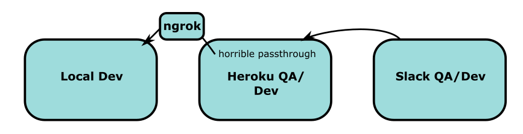

# Development Environment

## Overview

When setting up your development environment, there are a lot of moving parts. So before we get into the setup let's start with an overview of what all the pieces are and why you need them. Here are the pieces that you will have set up by the end of this document:

* The local Django application.
* The local react application.
* A Heroku app that serves as both a QA environment and as a gateway for working with Slack in your dev environment.
* A Slack Workspace. Because it is impossible to adequately simulate Slack locally we have to set up our own workspace to interact with.
* A local Django background_task runner.

Here is a simplified version of what you're about to set up:

(This is mostly a placeholder image that we'll improve upon later.)

So why is this so complicated? Well, we are building a Slack bot and the only way to be sure that you are building the right thing is to actually interact with a real Slack workspace, thus you really need to set up your own Slack workspace for development and QA. The additional problem is that Slack requires you to set up 3 different hooks – URLs that that Slack will send messages, commands, and interactions too. How do you point that traffic to your laptop during development? One way is to expose your local ports on the internet via a tunneling service (ngrok, localtunnel, and friend) and then every time you want to develop, you re-point your Slack workspace to the new endpoints. This is cumbersome. Instead, we have set up a (clever/horrible) development passthrough so that your development Slack can be pointed _permanently_ to your development Heroku application and the Heroku application can be easily instructed to pass through all traffic to your local development server. It's complicated to set up and understand, but after you've done it once, you don't have to think much about it any more. Additionally your Slack/Heroku setup serve as really great QA environments as exemplified in the [deployment docs](deployment.md).

## Requirements

* `python >= 3.7` & `pip3`
* `node >= 8.0` & `npm >= 6.3`

## Setup

Clone the repo: `git clone https://github.com/penny-university/penny_university.git`

### Set up Django environment:
* Create virtual env
* Install requirements:
    * `pip3 install -r requirements.txt`
    * `pip3 install -r dev-requirements.txt`
* Stick this in your environment: `export DJANGO_SETTINGS_MODULE="penny_university.settings.dev"`
* Run migrations: `./manage.py migrate`
* Bootstrap database with forum data: `cat dev/penny-university.mbox | ./manage.py import_google_forum --to_database --live_run`
* **Check:**
    * Run the server (`./manage.py runserver`) and load the homepage.
    * Run the shell (`./manage.py shell`) and make sure there's data (`PennyChat.objects.all()`)

### Set up and run React environment:
* Navigate to the `penny_university_frontend` directory
* Install requirements: `npm install`.
* Compile Sass files: `npm run compile:css` (Use `npm run compile:css:watch` if you want the files to compile automatically as they change.)
* Note: SCSS files that start with an underscore will not be compiled into CSS. Instead, you can import them into the main `style.scss` file. 
* Run the application: `npm run start`. A browser window should automatically open to the application's homepage, 
but if not, open a browser window and go to http://localhost:3000.
* Run tests:
    * `npm test` will run the frontend tests in an interactive "watch" 
environment. They will run each time you update a test.
    * To run tests without watching the files, run `CI=true npm test`
instead.

### Set up Heroku QA/dev:
* Get account (it's free)
* Create new app and call it "penny-<your_name>' and then follow instructions. Basically:
    * `brew install heroku cli`
    * Add your ssh key
    * Configure Heroku as a git remote: `heroku git:remote -a penny-<your_name>`
* Push your dev PennyU into that project: `git push heroku master`
* Set up environment vars:
    * `heroku config:set `heroku config:edit -a penny-<your_name>`
    ```
    DATABASE_URL=<already supplied>
    DJANGO_SETTINGS_MODULE=penny_university.settings.qa
    GUNICORN_CMD_ARGS='--workers=1'
    PENNY_DEBUG=TRUE
    SECRET_KEY=chicken_pajamas_dont_tell_no_one
    SLACK_API_KEY=xoxb-<we'll get to this soon>
    ```
* **Check:** visit https://penny-<your_name>.herokuapp.com/ and make sure it loads

### Set up Slack QA/dev:
* Create your own Slack team (https://slack.com/create) and call it "penny-<your_name>"
* Create a new app (https://api.slack.com/apps ... this URL comes up a lot) call it "dev_penny"
* In the "OAuth & Permissions" tab set up auth scopes:
    * Bot Token Scopes:
        * channels:read
        * chat:write
        * commands
        * users:read
        * users:read.email
    * User Token Scopes:
        * channel:history
        * chat:write
    * Install the bot in your App. (Note that if you have problems with auth scopes, you'll likely need to reinstall.)
* Stick the "Bot User OAuth Access Token" into your Heroku config as the `SLACK_API_KEY`
* Set up slack callback hook URLs to point to Heroku QA
    * Subscribe to messages in public channels:
        * Make your Heroku app is awake (e.g. visit the home page) because the server will be expected to respond to a request from Slack.
        * In the "Event Subscriptions" tab set the request URL to "https://penny-<your_name>.herokuapp.com/bot/hook/".
        * Make sure that it says that the request is "Verified". (It will be verified if the Heroku app responds to a test request. It is set up to do so.)
    * Create bot command: 
        * In the "Slash Commands" section create a command called `/penny`.
        * Set the URL hook to "https://penny-<your_name>.herokuapp.com/bot/command/"
    * Set up modal interaction: 
        * In the "Interactivity & Shortcut" section, turn on interactivity.
        * Set the URL hook to "https://penny-<your_name>.herokuapp.com/bot/interactive/"
    * **Check:**
        * Open Heroku logs `heroku logs -t -a penny-<your_name>`
        * Type messages in a public channel in your Slack workspace and see that they show up in logs. (This will exercise the `/hook` URL.)
        * Type `/penny chat` and invite a public channel to a chat and see that they show up in logs. (This will exercise the `/command` URL.)
        * Interact with the modal that pops up and see that they show up in logs. (This will exercise the `/interactive` URL.)
        
### Set up horrible/clever passthrough to local dev:
* Set up tunneling:
    * Install `ngrok` and get an account (https://ngrok.com/).
    * Set up this alias in your environment `alias grok='open "https://penny-john.herokuapp.com/forward?host=" | pbcopy && ngrok http 8000'`
* Turn on tunnel:
    * Run `grok` alias. 
    * When the browser window opens, paste in the temporary domain name into the URL so that it looks like this https://penny-<your_name>.herokuapp.com/forward?host=<just_the_hexidecimals>.ngrok.io . This tells the Heroku app to pass all traffic through to the tunneled port on your computer.
* Run local processes:
    * The django server `./manage.py runserver`.
    * The background processes (in a different window) `./manage.py process_tasks`
* **Check:**
    * Type messages in a public channel in your Slack workspace and see that they show up in local django logs. (If they don't, then check Heroku logs to figure out why.)
    * Stick `import ipdb;ipdb.set_trace()` at the top of `bot.processors.pennychat.PennyChatBotModule#create_penny_chat` and type `/penny chat` in Slack. Make sure you can actually hit the debug point.
    
## Testing

We use pytest, which gets installed in the dev-requirements.txt (above). So all you have to do to run tests is run `pytest`.

We also have a git pre-commit hook that runs linting, Python tests, and JavaScript tests before allowing a commit. It is advised to use this because merging to master it guarded by the same checks, so you might as well clean your code up before pushing to GitHub. To install the pre-commit do this:

```sh
cp dev/pre-commit .git/hooks/pre-commit
chmod a+x .git/hooks/pre-commit
```
